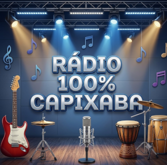

# 📻 Rádio 100% Capixaba

<p align="center">
  
</p>

<p align="center">
  <strong>Uma experiência web interativa dedicada à valorização e difusão da rica cultura musical do Espírito Santo.</strong>
</p>

<p align="center">
  
  
  
</p>

---

## 📌 Sobre o Projeto

A **Rádio 100% Capixaba** é um player de rádio web moderno e dinâmico, desenvolvido com foco na cena musical do Espírito Santo. O projeto compila sucessos de ícones nacionais e regionais capixabas, oferecendo aos ouvintes não apenas música de alta qualidade, mas também curiosidades culturais e históricas sobre cada artista.

A versão **v1.1** traz aprimoramentos no fluxo de execução, gerenciamento inteligente de reprodução via `localStorage` e integração avançada por `postMessage`.

---

## ✨ Funcionalidades Principais

* 🎶 **Playlist 100% Regional:** Mais de 50 faixas catalogadas englobando múltiplos gêneros (Rock, Reggae, Congo, Sertanejo, Forró Pé-de-Serra, Hardcore e Pop).
* 🔀 **Fila de Reprodução Inteligente (Shuffle & Cache):**
  * Sorteio aleatório sem repetição imediata de faixas.
  * Persistência da fila no `localStorage`, garantindo continuidade entre sessões.
* 💡 **Curiosidades do Artista:** Exibição dinâmica de fatos históricos e biografias resumidas sobre os artistas capixabas durante a reprodução.
* 🎨 **Interface 'Glassmorphism' & Background Dinâmico:** Visual moderno com efeito fosco e plano de fundo desfocado que se adapta à capa do álbum em reprodução.
* 🎛️ **Comunicação por iFrame (`postMessage`):** Suporte a comandos externos (`play_radio` e `stop_radio`) para integração simplificada em dashboards e portais.

---

## 🎨 Artistas e Estilos em Destaque

A rádio celebra a diversidade sonora do Espírito Santo, trazendo grandes nomes como:

* **Rock, Hardcore e MPB:** Roberto Carlos, Sérgio Sampaio, Supercombo, Dead Fish, Silva, Rastaclone.
* **Congo, Reggae e Fusion:** Casaca, Macucos, Manimal, Cidade do Reggae.
* **Forró & Sertanejo Capixaba:** Alemão do Forró, Chama Chuva, Forró Bemtivi, Trio Chapahall's, Dallas Company, Elias Wagner, Gabriel Gava.
* **Pop, Trap & Urban:** Budah, Nick Cruz, Daniel Caon.

---

## 📂 Estrutura de Arquivos

```text
radio-capixaba/
├── index.html            # Estrutura e marcação da aplicação
├── style.css             # Estilização com efeito Glassmorphism e CSS moderno
├── script.js            # Lógica de áudio, playlist, cache e eventos
├── img/                  # Logos, capas de álbuns e elementos visuais
│   ├── radiocapixaba.png # Logo oficial do projeto
│   └── ...              # Capas dos artistas (.png)
└── audio/                # Acervo de arquivos de áudio (.mp3) segmentado por artista